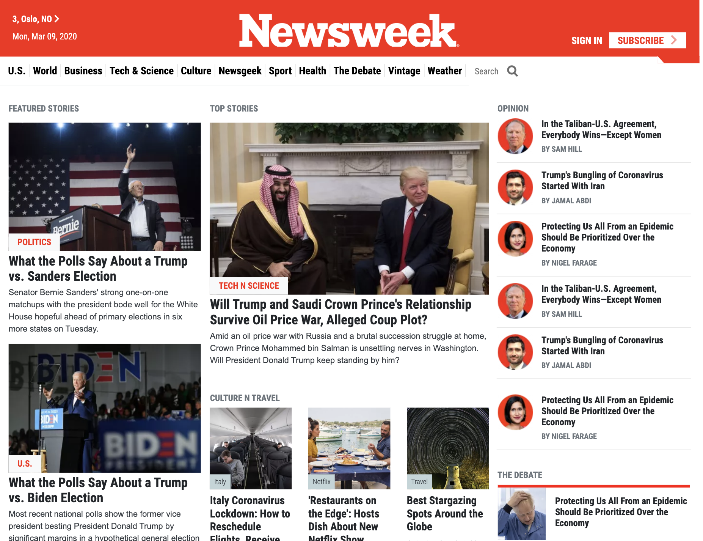

# Newsweek.com clone using Bootstrap 4
In this project I have build a replica of the news site Newsweek.com using the Bootstrap framework.

## Project features:
1. Project considers responsiveness on each Bootstrap breakpoint
2. Most of the styling and position is done using Bootstrap

## Built With

- HTML, CSS3
- Bootstrap 4
- Flexbox, Grid
- Fontawesome
- Media Queries

## Screenshot

## Live Demo

[Check it out!](https://newsweek-bootstrap.netlify.com/)

## Author

👤 **Azamat Nuriddinov**

- Github: [@bettercallazamat](https://github.com/bettercallazamat)
- Twitter: [@azamat_nuriddin](https://twitter.com/azamat_nuriddin)
- Linkedin: [Azamat Nuriddinov](https://www.linkedin.com/in/azamat-nuriddinov-57579868)

## 🤝 Contributing

Contributions, issues and feature requests are welcome!

Feel free to check the [issues page](issues/).

## Show your support

Give a ⭐️ if you like this project!